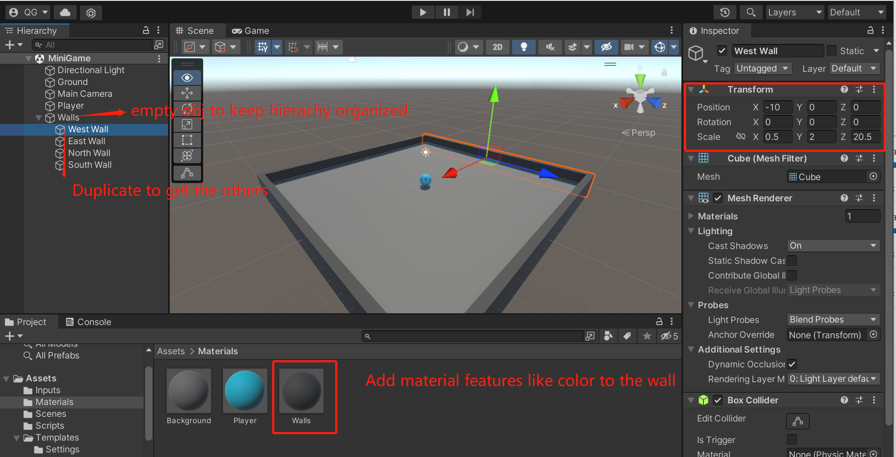

## 1. Play Area -> not triggerred Walls
You must have noticed that our sphere always fall out of the plane because there is no boundaries on its play area. Now we are gonna build foue walls around the edges to keep the sphere from falling off

1. Create an **empty** object to keep hierarchy organized, and name it Walls
2. Rescale its transformation and move it to fit one side of the area
3. Add material features like color, smoothness to the object
4. **Duplicate** it and adjust the transformation to get the other walls


``` ad-important
The sphere collide with the boundaries based on settings in Rigidbody and Box Collider components.

Make Sure you have disabled the `is trigger` checkbox in the Collider component, cuz it will trigger events once the wall is collided by the sphere.

In this case, we do not need the function.
```
2. 